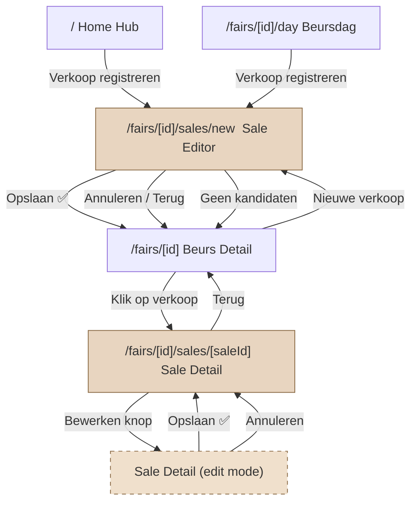
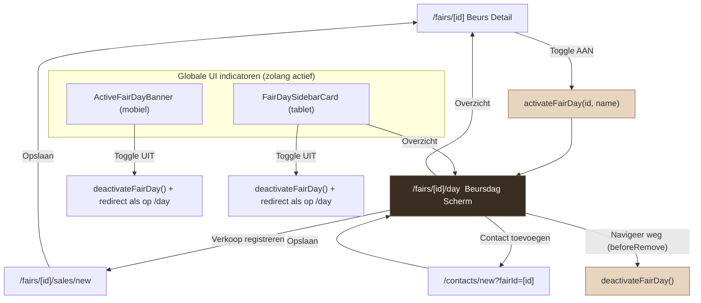

# BeursManager — User Flow Diagrams

Per-domein navigatieflows met context-risico's en frictie-punten.

---

## Flow 1: Sales (Verkoop)

### Navigatiediagram



### Entry points

| Vanuit | Route | Methode |
|--------|-------|---------|
| Home Hub | `/fairs/[id]/sales/new` | `router.push()` |
| Beurs Detail (FairSalesCard) | `/fairs/[id]/sales/new` | `<Link href>` |
| Beursdag scherm | `/fairs/[id]/sales/new` | `router.push()` |

### Na opslaan

| Scherm | Navigatie | Methode |
|--------|-----------|---------|
| Sale Editor → opslaan | `/fairs/[id]` (beurs detail) | `router.replace()` |
| Sale Detail → opslaan (edit mode) | Blijft op detail, exit edit mode | State toggle |

### Frictie-punten

1. **Editor → opslaan → altijd terug naar beurs detail.** Als je vanuit beursdag-modus een verkoop registreert, land je na opslaan op de beurs detail pagina — niet terug in beursdag. Je verliest je context.

2. **Home Hub → verkoop → geen actieve beurs.** Als er geen beurs actief is, stuurt Home Hub je naar `/fairs/new` (nieuwe beurs aanmaken). Dat is een lange omweg als je eigenlijk een verkoop wilde registreren.

3. **Sale Detail edit mode is inline.** Bewerken gebeurt op hetzelfde scherm via state toggle. Dit is goed (geen navigatie-verwarring), maar de EmptyState-knop bij "Verkoop niet gevonden" doet niets (dode knop — staat in quality round 2 om te fixen).

---

## Flow 2: Beursdag-modus

### Navigatiediagram



### Activatie

| Trigger | Scherm | Actie |
|---------|--------|-------|
| Toggle AAN | Beurs Detail | `activateFairDay(id, name)` → `router.push(/fairs/[id]/day)` |

### Deactivatie

| Trigger | Context | Actie |
|---------|---------|-------|
| `beforeRemove` listener | Navigeren weg van beursdag scherm | `deactivateFairDay()` automatisch |
| Banner toggle (mobiel) | Overal in de app | `deactivateFairDay()` + redirect naar detail als op `/day` |
| Sidebar toggle (tablet) | Overal in de app | `deactivateFairDay()` + redirect naar detail als op `/day` |
| Fair detail toggle | Beurs Detail | `deactivateFairDay()` |

### Context-risico's

1. **Verkoop vanuit beursdag → landing op beurs detail, niet terug naar beursdag.** Na het registreren van een verkoop (`router.replace(/fairs/[id])`) land je op de beurs detail pagina. Omdat `beforeRemove` op het beursdag-scherm al heeft gevuurd, is de beursdag-modus nu UIT. De gebruiker moet opnieuw activeren om door te gaan. Dit is de grootste flow-breuk.

2. **Contact toevoegen werkt wél correct.** Na opslaan van een contact navigeer je terug naar `/fairs/[id]/day` — beursdag blijft actief.

3. **`beforeRemove` is te agressief.** Elke navigatie weg van het beursdag-scherm deactiveert de modus. Dit maakt het onmogelijk om vanuit beursdag een verkoop te doen en terug te keren naar beursdag-modus.

4. **Dubbele deactivatie-paden.** Banner, sidebar én `beforeRemove` kunnen allemaal `deactivateFairDay()` aanroepen. Bij snelle navigatie kan dit race conditions veroorzaken (vooral de redirect-logica).

### Aanbeveling

De `beforeRemove` listener in `FairDayScreen` zou niet onvoorwaardelijk moeten deactiveren. Beter: alleen deactiveren als de gebruiker expliciet de modus uitzet (via toggle), niet bij elke navigatie. Dan kan de gebruiker vanuit beursdag een verkoop doen en terugkeren.

---

## Overzicht: Alle schermroutes

```
app/(tabs)/
├── index.tsx                    → Home Hub
├── inventory/
│   ├── index.tsx                → Voorraad lijst
│   ├── new.tsx                  → Nieuw kunstwerk
│   └── [id].tsx                 → Kunstwerk detail/edit
├── fairs/
│   ├── index.tsx                → Beurzen lijst
│   ├── new.tsx                  → Nieuwe beurs
│   └── [id]/
│       ├── index.tsx            → Beurs detail
│       ├── edit.tsx             → Beurs bewerken
│       ├── day.tsx              → Beursdag-modus
│       ├── sales/
│       │   ├── new.tsx          → Nieuwe verkoop
│       │   └── [saleId].tsx     → Verkoop detail
│       └── expenses/
│           └── new.tsx          → Nieuwe onkost
├── contacts/
│   ├── index.tsx                → Contacten lijst
│   ├── new.tsx                  → Nieuw contact
│   └── [id].tsx                 → Contact detail
├── reports.tsx                  → Rapporten
└── settings.tsx                 → Instellingen
```
